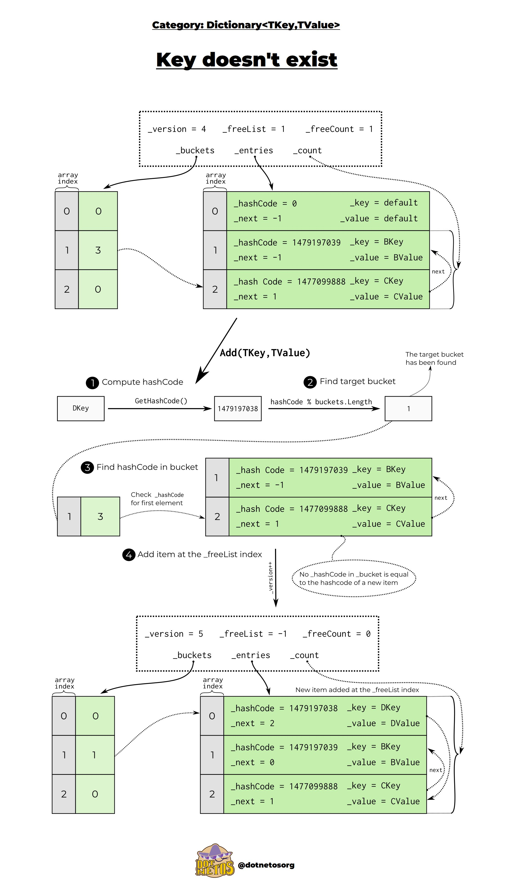

# Memory

## Table of content

- [Memory](#memory)
  - [Table of content](#table-of-content)
  - [How does it work](#how-does-it-work)
  - [Heap vs stack](#heap-vs-stack)
    - [Value \& reference types](#value--reference-types)
    - [Misc - Heap/Stack](#misc---heapstack)
  - [Garbage Collection](#garbage-collection)
  - [SOH and LOH](#soh-and-loh)
  - [Managed and unManaged](#managed-and-unmanaged)
  - [IDisposable](#idisposable)
  - [IAsyncDisposable](#iasyncdisposable)
    - [Best Practice](#best-practice)
    - [Finalizers](#finalizers)
  - [Lists](#lists)
    - [Information](#information)
    - [Composition](#composition)
    - [Misc - List](#misc---list)
    - [Contiguous](#contiguous)
  - [Dictionary](#dictionary)
    - [Data Structure](#data-structure)
    - [Adding new elements](#adding-new-elements)
    - [Resizing](#resizing)
    - [Conclusion](#conclusion)

## How does it work

In C#, when you create an object of a reference type, the CLR (Common Language Runtime) allocates memory for the object on the managed heap. The variable that holds the reference to this object is stored on the stack.

When you pass a reference type to a method, you are actually passing the reference by default. This can lead to unintentional side effects if not managed properly.

## Heap vs stack

There are two main locations to store elements in memory: the heap and the stack. The stack represents the static elements (ints, structs) while the heap contains dynamic elements (class data). The stack only contains a reference to the CLASS IN the heap.

Quand on passe un objet static à une méthode, on passe une copie de l'objet et ainsi il n'est pas modifié. Si on veut que l'objet soit modifié, on passe avec le mot-clé **ref**. A ce moment là, on passe la référence précise de l'objet et il sera modifié. Il existe aussi le mot-clé **out**. Ce mot-clé sert à passer une référence pour un objet qui n'a pas été initialisé.

```cs
public static int AddTwoNumbers(int a, ref int b, out int c)
{
  b += 10;
  int sum = a + b;
  c = sum / 10;
  return sum;
}

// We can then do something like that.
int a = 100;
int c;
AddTwoNumbers(a, ref b, out c);
```

Si on passe une classe en ref, on crée un pointeur qui pointe sur la référence en stack de l'objet en heap. Cela rajoute une couche.

### Value & reference types

Value types:

- User Defined
  - Enum
  - Struct
- Predefined
  - Integer
  - Boolean

Reference types

- User Defined
  - Class
  - Inheritance
- Predefined
  - String
  - Array

Types are organized in NameSpaces.

### Misc - Heap/Stack

**String is a reference type** but strings are immutable. It can have an impact on performance. Use a string builder if you have loops.

```cs
using System.Text;

StringBuilder stringbuilder = new StringBuilder();
stringbuilder.Append("Employees");
stringbuilder.AppendLine("BOB"); // Adds a linebreak.
string list = stringBuilder.ToString();
```

## Garbage Collection

The fundamental operation of garbage collection in C# involves several key steps:

- **Marking**: The GC identifies which objects are still accessible from the root references. Root references include static variables, local variables, and CPU registers. During this phase, the GC traverses the object graph starting from these roots, marking all reachable objects.
- **Sweeping**: After marking, the garbage collector sweeps through the heap to identify unmarked objects, which are considered unreachable. These objects are eligible for collection.
- **Compacting**: To optimize memory usage, the GC may compact the heap by moving objects together, eliminating gaps left by collected objects. This compaction process helps in reducing fragmentation and allows for faster allocation of new objects.

GC only triggers at some moments. For example, it triggers when you are about to create a new object in code to check that there is enough memory. Depending on the pressure the app is under, it decides if it runs only on Generation 0 of SOH or Gen 0 + Gen 1 or the full chebang.

There is a method to call the garbage collector:

```cs
GC.SuppressFinalize(this);
```

## SOH and LOH

Small Object Heap and Large Object Heap. We want to avoid to have to check the whole heap for garbage collection. In order to avoid that, we have two kinds of heap. in the SOH, our data are separated in three parts called the generations. When an object is created, it is added to the generation 0. When it is full, we pass them to a higher generation. The garbage collector checks in priority elements on generation 0, sometimes check 1 and 2.

LOH is made of all objects of size > 85 kO.

## Managed and unManaged

The garbage collector only handles objects that are managed, objects it itself created. For un-managed objects, it is the developer's task to handle them. Databases and files are unmanaged files. These files implement IDisposable.

## IDisposable

It has nothing to do with garbage collection, it just means that there is a mechanism to release unmanaged resources. IDisposable gives the action to free / release / reset unmanaged resource.

Applications that interact with elements outside of dotnet handle unmanaged elements. If you handle files, data & connection, you have unmanaged elements.

Data Streams, DbConnections & HttpClients implement IDisposable and expect you to tell when you are done with the resources.

Standard way of working with IDisposable objects is:

```cs
using (var obj = new Custom())
{
  obj.DoStuff();
} // Here, we dispose of the object. It behaves like a try and finally.
```

## IAsyncDisposable

Handles asynchronous files. Came with C# 8. It contains a method called DisposeAsync. Same idea than previous paragraph.

### Best Practice

If you have an IDisposable object, dispose of it as soon as you are done with it. You don't want to forget about a connection that is still open.

If you use IDisposable objects as instance fields, implement IDisposable.

Make sure we can call the Dispose() method multiple times without exceptions.

If you want to use tools to help, turn on the AnalysisMode with \<AnalysisMode>AllEnabledByDefault</AnalysisMode>

Most times, just use the using command to make sure the objects are disposed of at the end of the operations, sometimes (for example with HttpClient), you want the object to last for a moment so make it a private variable and use it multiple times. Dispose of it when it is not needed anymore.

### Finalizers

Last chance to dispose of resources. Use a ~ to define your finalizer. If you have unmanaged resources, call the finalizer to Dispose of them.

## Lists

### Information

Lists implement multiple interfaces (ICollection, IEnumerable, IList...). List stores all elements as a reference to a single array of elements of T type.

### Composition

Lists are an array with capacity n with three main elements:

- items (elements)
- size (number of items in the list)
- version (changes as the list is modified. Increments every time an operation takes place.)

Every time the size is equal to the capacity, we double the array capacity.

With these elements: adding a new element to a list is complecity of O(1) but becomes O(n) when the list needs to be resized. Inserts have a complexity of O(n) because we have to move the other elements.

### Misc - List

A span is a struct that points to an element and the surrounding elements. Spans in fact just store a pointer.

### Contiguous

Elements in a list are stored as an array, therefore they are contiguous in memory. If you have a linked list, every element lives independently of the others => they can be fragmented and saved elsewhere.

## Dictionary

Interesting article: <https://dotnetos.org/blog/2022-03-28-dictionary-implementation/>

Actual implementation of a dictionary in dotnet: <https://medium.com/@vosarat1995/how-c-dictionary-actually-works-47f3a156055b>

Note: due to the structure of a dictionary, the iteration is unordered and the order will change over time.

### Data Structure

Dictionary has two main internal structures:

1) **Buckets**: Set of elements with similar hash. An array of integers, each pointing to the index of the first entry in that bucket. Target bucket is found with (hashCode % buckets.Length) <== **THIS IS SHARDING**
2) **Entries**: an array of structs that actually hold the key, value, hash code, and a pointer to the next entry in case of a collision.

A single bucket can contain multiple entries if different keys have the same hash modulo array size. This is called chaining.

There are some other elements to have version, number of empty spaces in the bucket, count of elements...

Average lookup is O(1), worst-case O(n) if all keys collide in the same bucket.

### Adding new elements

1) Compute the hash code of the key.
2) Find the target bucket (hashCode % buckets.Length).
3) Check existing entries in that bucket for equality (Equals() method).
4) If the key exists, update the value; if not, create a new entry and link it to the bucket chain.



GetHashCode() and Equals() are critical: poor hash distribution hurts performance.

### Resizing

When the number of items exceeds a certain load factor / fill factor (~0.75 of the array size), the dictionary resizes:

- Allocates a larger array for buckets and entries. (We double size of use prime numbers).
- Recalculates bucket indices for all entries because hashCode % newArray.Length changes.

This ensures lookups stay O(1) on average.

### Conclusion

- A Dictionary stores a set of buckets and entries.
- Index of a bucket - i - is calculated based on the hash code of the key.
- The value of the bucket[i] contains the index of a record in entries.
- The matching entry either matches the key or has another entry in the links chain that does (or the key doesn’t exist in a dictionary).
- To find the actual value, Dictionary cycles by the links until it finds a matching key or stops at the dead-end (0 or -1 in next).
