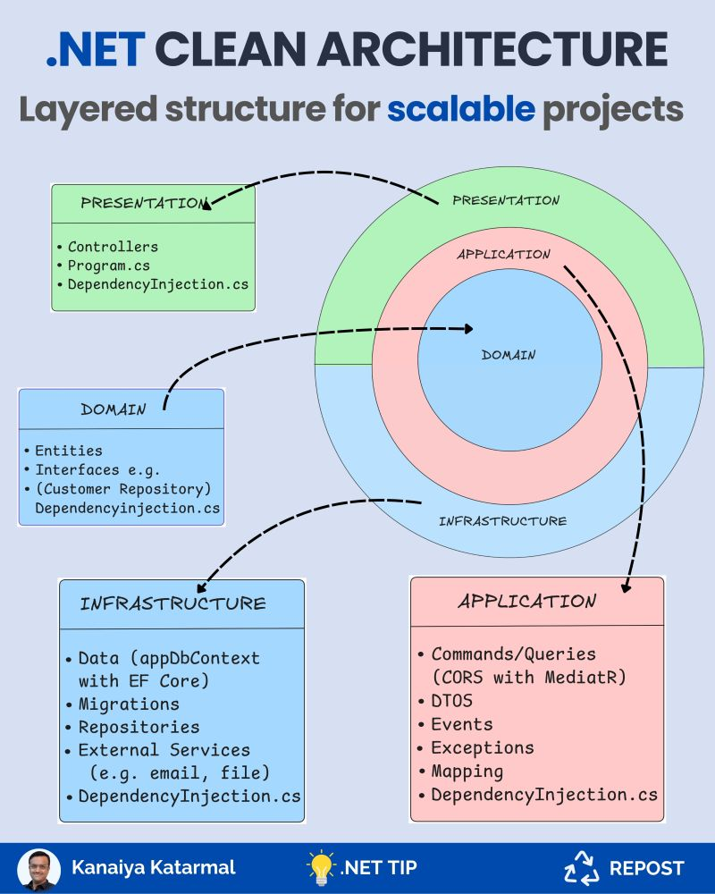

# Clean Architecture

## Table of Content

- [Clean Architecture](#clean-architecture)
  - [Table of Content](#table-of-content)
  - [Layers](#layers)
  - [Domain Layer](#domain-layer)
  - [Application Layer](#application-layer)
  - [Infrastructure Layer](#infrastructure-layer)
  - [Interface layer](#interface-layer)

## Layers

- **Infrastructure Layer** (DbContext, repository implementation, Logging...) Things that have to do with the building block.
- **Interface Layer** (API Controllers, request validation). Bridge between outside world and core logic.
- **Application Layer** (Repository interfaces, business user cases, services interfaces & implementations).
- **Domain Layer** (Core business entities and value objects). Core business objects like Employees, payments, orders...

## Domain Layer

Create a Product.cs file and put in place all the business validation rules (example: stocks cannot be negative).

## Application Layer

Create a CreateProduct request with all the information to create a product.

Have a product update request.

Have the repository interface for the IProductRepository.

## Infrastructure Layer

DbContext & ConcreteProductRepository.

## Interface layer

Have the API Controller with all the endpoints. Have the programm.cs with dependency injection.
