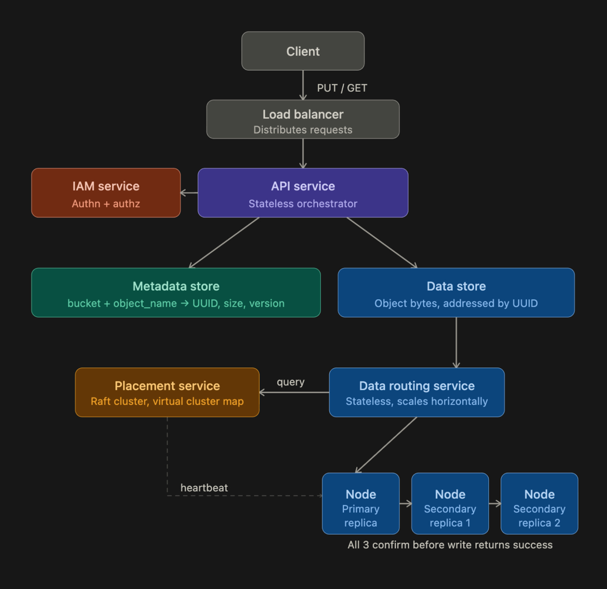

# Database

## Table of content

- [Database](#database)
  - [Table of content](#table-of-content)
  - [ACID properties](#acid-properties)
  - [ORM](#orm)
  - [Main types of storage](#main-types-of-storage)
    - [Block storage](#block-storage)
    - [File storage](#file-storage)
    - [Object storage](#object-storage)
    - [How to design object Storage?](#how-to-design-object-storage)

## ACID properties

- Atomicity (works or fails completely)
- Consistency (valid state to valid state)
- Isolation (independant transactions)
- Durability (durable changes)

## ORM

Object-Relational Mapping. Integrates object-oriented principles in databases.

The objective of an ORM is to abstract database complexity, make it reusable and make it easy to maintain.

Some ORM examples include Django ORM, SQLAlchemy and .Net Core.

## Main types of storage

### Block storage

Objects are stored as blocks of same size. There is no structure on how they are arranged. Fast and easy to use but can be expensive.

### File storage

There is a clear hierarchy. Objects can be of different size and nature. Built on top of block storage.

### Object storage

Flat namespace. Objects have metadata and payloads (actual data). It is slower but it has great scalability and low cost. Objects are immutable.

### How to design object Storage?

What size of uplaods / downloads do we need to support? What are the access control rules?

A pragmatic view of capacity: most objects will be small / medium objects that will be smaller in size than 64Mb. Small objects are config file whose size will be smaller than 1Mb. If we have 1 Pb of storage space, how many files can we store?

Estimations:

- small Object = 20%, 0.5Mb
- Medium Object = 60%, 32Mb
- Large Object = 20%, 200Mb

```maths
100 PB = 10^11 MB

Weighted average object size: (0.2 x 0.5MB) + (0.6 x 32MB) + (0.2 x 200MB)

= 0.1 + 19.2 + 40.0

= 59.3 MB per object (average)

Total objects at 40% utilization: (10^11 x 0.4) / 59.3
```

Each object need metadata ~1Kb per object. Metadata are stored in different place than objects because they have different properties. They are mutable, you can update tags & rename them.



How do we concretely store data?

- Data Routing service determines which data node should receive which information. It interacts with the placement service to send orders and ask where the data live.
- Placement Service knows the physical layout of our storage cluster. It maintains a cluster map to know where each data is stored at which place.
- Nodes: that is where the data actually lives.
